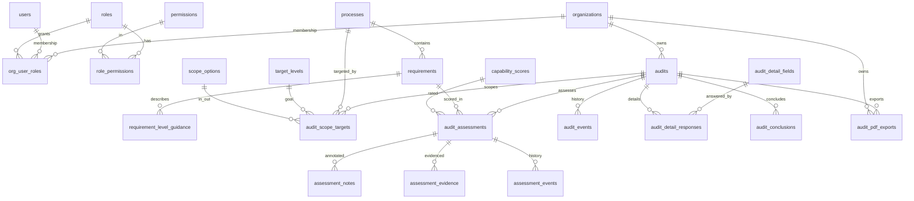

# Database Schema Overview

The authoritative schema lives in `db/migrations/*.sql` (applied via `scripts/migrate.sh`).
`apps/api/drizzle/schema.ts` is a partial typed-query reference only and does not drive
migrations.

## Table of Contents

- [Entity relationships](#entity-relationships)
- [Domains](#domains)
- [Reporting views](#reporting-views)
- [Conventions](#conventions)
- [Known gaps](#known-gaps)
- [License footer](#license-footer)

## Entity relationships

Audit-trail / `created_by` / `updated_by` columns reference `users(id)` from almost every
table; those edges are omitted below to keep the core structure readable.

## Domains

- Identity and access: `organizations`, `users`, `roles`, `permissions`, `role_permissions`,
  `org_user_roles`. Non-system-admin users are scoped to a single organization.
- FitSM reference catalog: `processes`, `requirements`, `requirement_level_guidance`,
  `capability_scores`, `target_levels`, `scope_options`.
- Audit lifecycle: `audits`, `audit_scope_targets`, `audit_assessments`, `assessment_notes`,
  `assessment_evidence`, `audit_detail_fields`, `audit_detail_responses`, `audit_conclusions`,
  `audit_pdf_exports`.
- Activity trail: `audit_events`, `assessment_events`.

## Reporting views

Defined in `db/migrations/0012_views.sql`:

- `v_all_results` - every assessment result joined to its process/requirement/score.
- `v_certification_results` - results filtered to certification scope.
- `v_gap_analysis` - requirements below their target level.
- `v_trends` - per-audit aggregates for trend reporting.

## Conventions

- Every UTC datetime column name ends with `_UTC` (e.g. `created_at_UTC`, `archived_at_UTC`,
  `pii_redacted_at_UTC`).
- Archive-only lifecycle: rows are never hard-deleted. "Delete" sets `archived_at_UTC`;
  "restore" sets it back to `NULL`. Uniqueness among active rows is enforced with generated
  `active_*` columns that are `NULL` when archived.

## Known gaps

- PII redaction columns (`users.pii_redacted_at_UTC`, `audit_assessments.pii_redacted_at_UTC`)
  are modeled but no API action or script performs in-place redaction yet. Redaction is a
  planned capability; until implemented these columns remain `NULL`.

## License footer

© Audit FitSM contributors. Licensed under [CC BY 4.0](../LICENSE.md).
